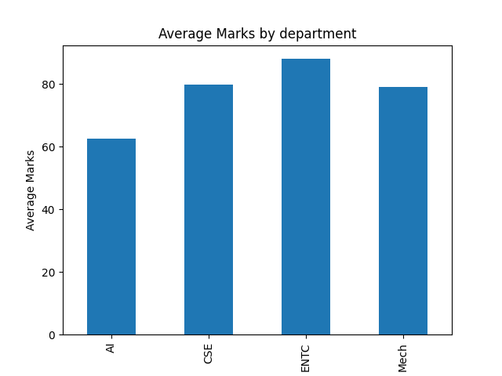
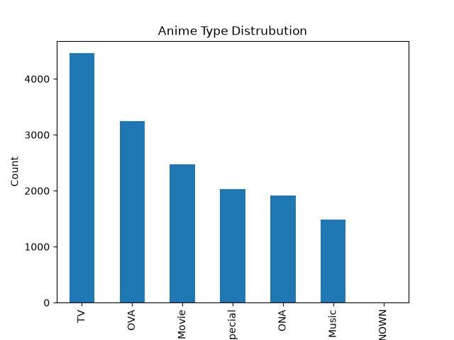
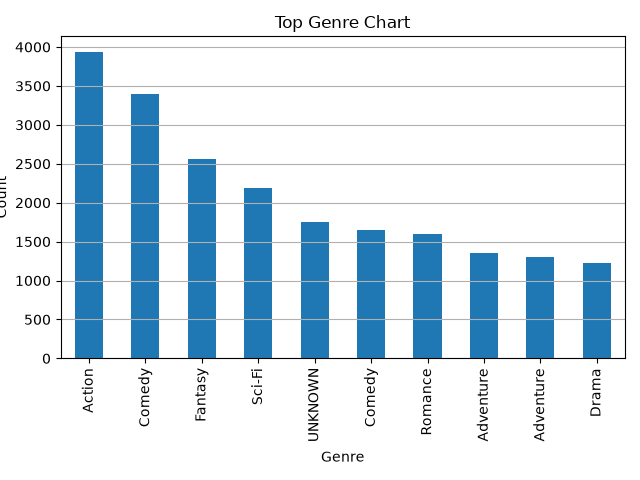
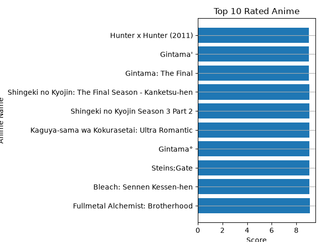

# 🐼 Pandas Projects Collection

A collection of beginner-friendly and real-world data analysis projects built using **Pandas**, **NumPy**, and **Matplotlib** as part of my AI/ML learning journey.

These projects focus on data cleaning, data analysis, visualization, and extracting meaningful insights from structured datasets.

---

# 📚 Projects

## 1. 🎓 Student Performance Analysis

A beginner-friendly project that analyzes student academic performance and attendance records.

### Features

* Top 3 students analysis
* Bottom 3 students analysis
* Above-average performers
* Department-wise average marks
* Attendance analysis
* Department toppers
* Best performing department
* Bar chart visualization

### Concepts Used

* DataFrame Creation
* Filtering
* Boolean Indexing
* GroupBy
* Aggregation Functions
* `nlargest()`
* `nsmallest()`
* `idxmax()`
* Matplotlib Bar Charts

### Visualization



---

## 2. 🎌 Anime Data Analysis

A real-world Exploratory Data Analysis (EDA) project built using a Kaggle Anime Dataset.

### Features

* Dataset exploration
* Data cleaning
* Top 10 highest-rated anime
* Highest-rated TV anime
* Highest-rated movie anime
* Most popular anime by members
* Top genres analysis
* Genre-wise average score analysis
* Anime type distribution

### Concepts Used

* Data Cleaning
* Filtering
* String Manipulation
* `groupby()`
* `value_counts()`
* `sort_values()`
* `split()`
* `explode()`
* Aggregation
* Matplotlib Visualizations

### Visualizations

#### Anime Type Distribution



#### Top Genres



#### Genre Score Distribution


#### Top Rated Anime



---

# 🛠️ Technologies Used

* Python 3
* Pandas
* NumPy
* Matplotlib

---

# 🎯 Learning Outcomes

Through these projects, I learned:

* Data cleaning and preprocessing
* Exploratory Data Analysis (EDA)
* Data visualization techniques
* Grouping and aggregation operations
* Working with real-world datasets
* Extracting insights from structured data
* Preparing datasets for Machine Learning workflows

---

# 📂 Project Structure

```text
pandas/
│
├── README.md
│
├── student_performance_analysis.py
├── avg_marks_analysis.png
│
├── anime_analysis.py
├── anime.csv
├── anime_type_dist.png
├── top_genres.png
├── genre_score_distribution.png
├── top_10_rated.png
```

---

### ⭐ Key Takeaway

These projects represent my transition from learning Pandas fundamentals to applying data analysis techniques on real-world datasets. They helped strengthen my understanding of data manipulation, visualization, and exploratory analysis, building a foundation for future Machine Learning projects.
